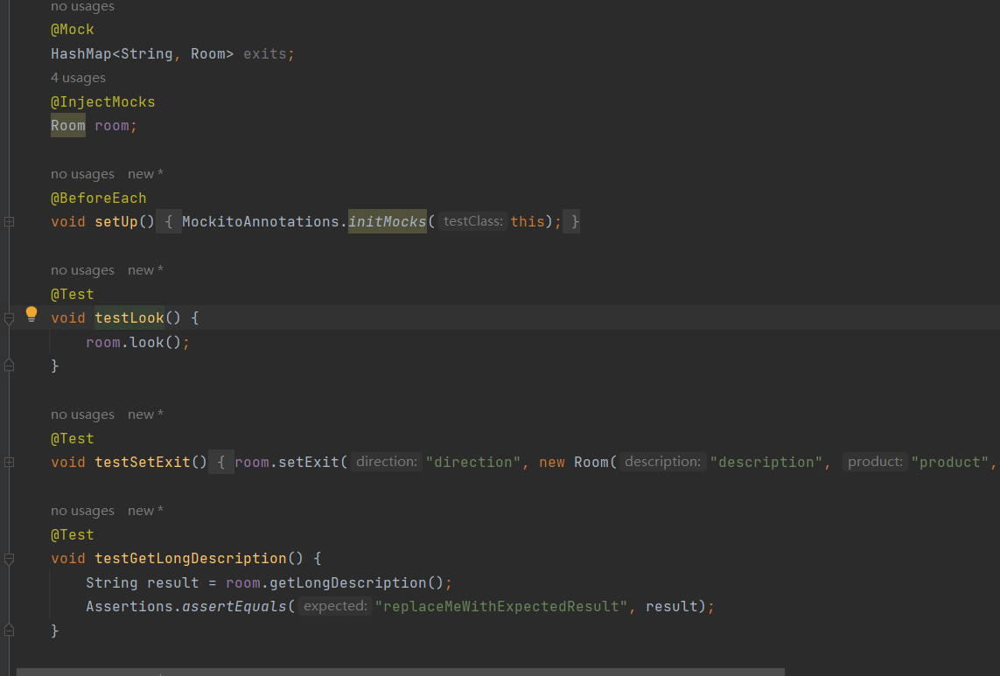

# 1 任务概述

## 主要内容

- 阅读、理解和标注样例代码
- 分析和学习代码质量特征、设计方法和编程风格
- 运用所学方法，对开源代码进行标注
- 对样例工程进行简单功能扩充和维护

## 任务目的

- 理解软件代码规范的重要性
- 理解代码变化对软件质量带来的影响
- 掌握基于Git的个人代码版本维护方法
- 掌握MarkDown文件编写方法

# 2 任务分析

-  本次实践任务主要是对原来的代码进行注释并进行一些内容的扩充。
- 其中还包括对一些赘余代码的修改，比如，其中多个if-else语句的嵌套使用可以用switch-case语句代替，使得原来的代码变得更加清晰明了。
- 本次实验是通过编写多个类，并通过类之间的相互调用，实现所有功能。
- 其中包括3点功能的扩充，第一点是房间增加了物品、描述和重量，通过增加相应属性和增加一个look方法实现；第二点和第三点是增加了回退功能，可以退到上一个房间甚至逐层回退，一直到起始位置，通过增加一个房间数组实现，前进加1，后退减1。
- 通过使用IDEA工具进行调试分析，代码可以很快得到检验和完善，运行效果成功。

# 3 开发计划

## 编写目的
说明：编写这份软件项目开发计划的目的，并指出预期的读者。

主要是对机房收费系统的费用，时间，人员组织，硬件的设备，开发环境和运行环境的配置说明，为开发的下一步做准备。

## 背景

待开发的软件系统的名称；
本项目的任务提出者、开发者、用户及实现该软件的计算中心或计算机网络；

用户：所有人

实现该软件的中心或计算机网络，图书馆阅览室，机房

该软件系统同其他系统或其他机构的基本的相互来往关系。
IDEA开发

## 工作内容

 分析，计划，编码，测试，维护

## 程序

列出须移交给用户的程序的名称、所用地编程语言及存储程序的媒体形式，并通过引用相关文件，逐项说明其功能和能力。

1. 程序名称：World of Zuul游戏
2. 所用语言： JAVA
3. 存储形式：代码被封装在窗体模块中

# 4 软件配置计划

 **1. Master**
**存放的是随时可供在生产环境中部署的代码**。当开发活动告一段落， 产生了一份新的可供部署的代码时，master 分支上的代码会被更新。同时，每一次更新，都添加对应的版本号标签（tag）。
**2. Develop**
**保存当前最新开发成果的分支**。通常这个分支上的代码也是可进行 每日 / 夜间发布的代码。当 develop 分支上的代码已实现了软件需求说明书中所有的功能，**通过了所有的测试，并且代码已经足够稳定时，就可以将所有的开发成果合并回 master 分支了**。
**3. Feature**
**用于开发新功能时所使用的分支**。从 develop 分支发起 feature 分支， 代码必须合并回 develop 分支。此分支甚至可以仅仅保存在开发者自己的代码库里而不提交。
**4. release**
**用于辅助版本发布的分支**。从 develop 分支派生，必须合并回 develop 分支和 master 分支。此分支是为发布新的产品版本而设计的，当 develop 上开发的功能基本成形且可以发布的时候，就可以派生出 release 版本。这个分支上的代码允许做小的缺陷修正、准备发布版本所需的各项说明信息，如版本号、发布时间、编译时间等。
**5. Hotfix**
**用于修正生产代码中有缺陷的分支**。从 master 分支派生且必须合并回master 分支和 develop 分支。此分支一般是计划外的分支，但最终输出和 release 分支类似，都可以产生一个新的可供在生产环境部署的软件版本。当生产环境遇到了异常情况或者需要紧急修复的 Bug 时，就可以从 master 分支上指定的 tag 版本派生hotfix 分支来组织代码的紧急修复工作。

# 5 测试计划

 我们完成任务后要进行单元测试，这里我们使用IDEA的插件testme进行单元测试，原理也是使用Junit。要避免出现一下情况：构造方法中做的事情过多。存在过多的全局变量和静态方法。存在过多的外部依赖。存在过多的条件语句。测试要覆盖实现中的代码的各个分支。一个测试方法只测试一个方法，不测试私有方法一个测试类只对应一个被测类。测试用例的变量和方法都要有明确的含义。

# 6 实施情况

 在代码中存在一些缺陷，在Game类的processCommand()方法中，当用户输入的命令被辨认出来以后，有一系列的if语句用来分派程序到不同的地方去执行。从面向对象的设计原则来看，这种解决方案不太好，因为每当要加入一个新的命令时，就得在这一堆if语句中再加入一个if分支，最终会导致这个方法的代码膨胀得极其臃肿。我们可以通过switch-case语句来实现这个效果。

同时我们在CommanWords类中加入相应单词，便可以很好的实现这个效果，下面是我们运行效果图

# 7 实施过程问题记录与分析

 在项目开发过程中可能会遇到添加了look和back单词后无法使用，出现无法识别这个单词的情况，这是因为相应单词中没加入look和back，同时，使用back这个单词的功能主要是用来实现回退功能，这里我们通过数组来实现，要注意加1和减1的地方，有的地方不需要自增和自减。下面我们来看一下UML用例图和类图。

# 8 任务总结

此次实践中，我对代码完成了注释，成功将代码读懂，也学习了一下java这个早就忘记了的语言，编码能力有了一定的提高，同时向源代码中增加了一些功能，比如look和back，通过look我们可以查看此房间中的物品描述和重量，通过back我们可以回到上一级房间，甚至可以多次回退，直到退到最开始的房间。其中出现了一些错误，比如我没有在commandWords里面增加相应的单词就会出现没有找到命令的错误。总之，通过此次实践的学习，我的java功底有了一定的提高，编码能力有了一定的提高。

# 9 参考文献

应用型本科院校软件工程专业实践教学体系探索与实践 王洪欣 2022-09-15